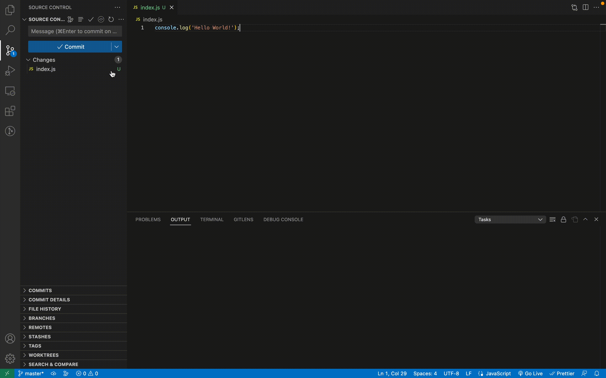

# GPT Commit

VS Code extension which helps to generate AI commit messages using ChatGPT.

## Features

You can generate commit message by pressing 'Generate AI commit' button in source control tab:

> Tip: You could also generate commit from command pallete by calling 'Generate AI commit' command.

## Requirements

You need Open AI API Key to make this extension work.
You can get your API key from [OpenAI](https://platform.openai.com/account/api-keys).

## Extension Settings

GPT Commit extension contributes the following settings:

* `gptcommit.openAI.apiKey`: OpenAI API Key. Needed for generating AI commit messages
* `gptcommit.appearance.delimeter`: Delimeter between commit lines

## Release Notes

### 1.0.0
Initial release of GPT Commit

### 1.0.1
Updated icons

### 1.0.2
Fixed UX

### 1.0.3
Added Open AI API Key input prompt

### 1.0.4
Updated commit formatting. Added new setting

## License

Released under [MIT](/LICENSE) by [@dmytrobaida](https://github.com/dmytrobaida).